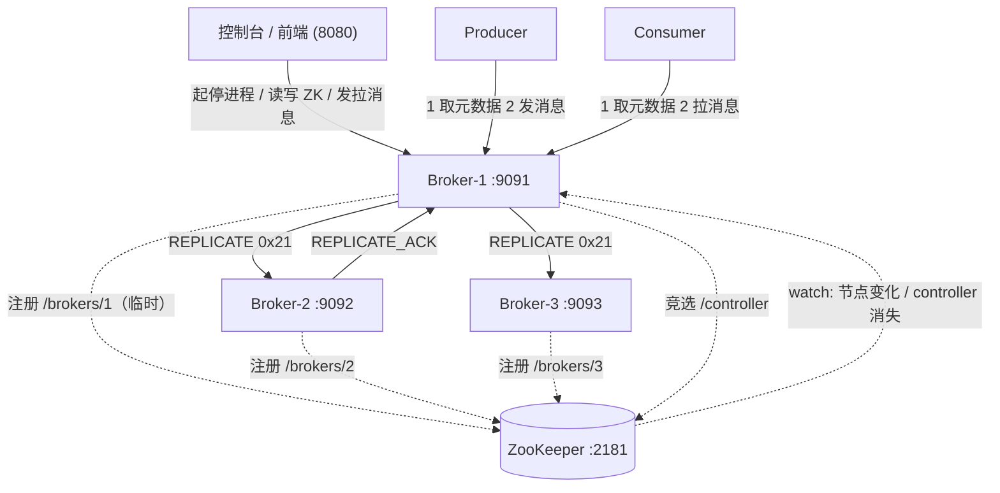
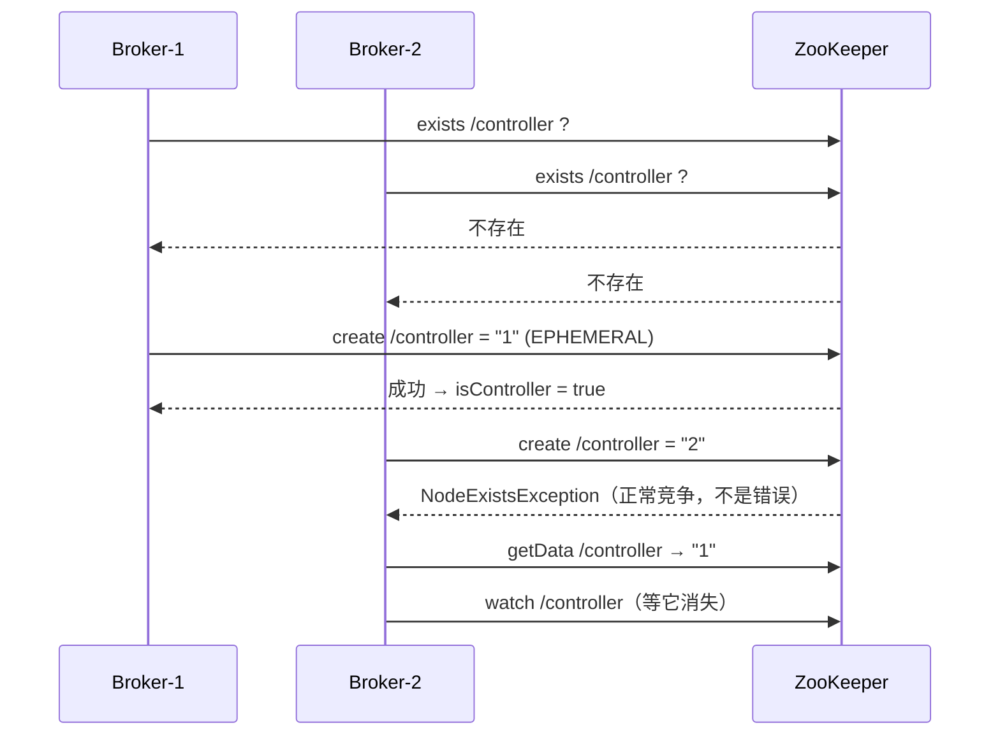
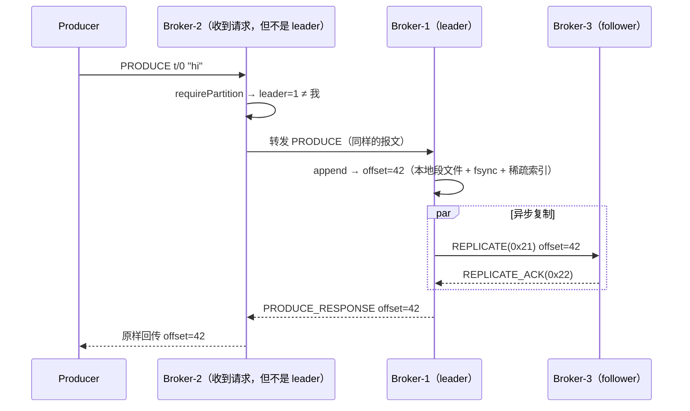
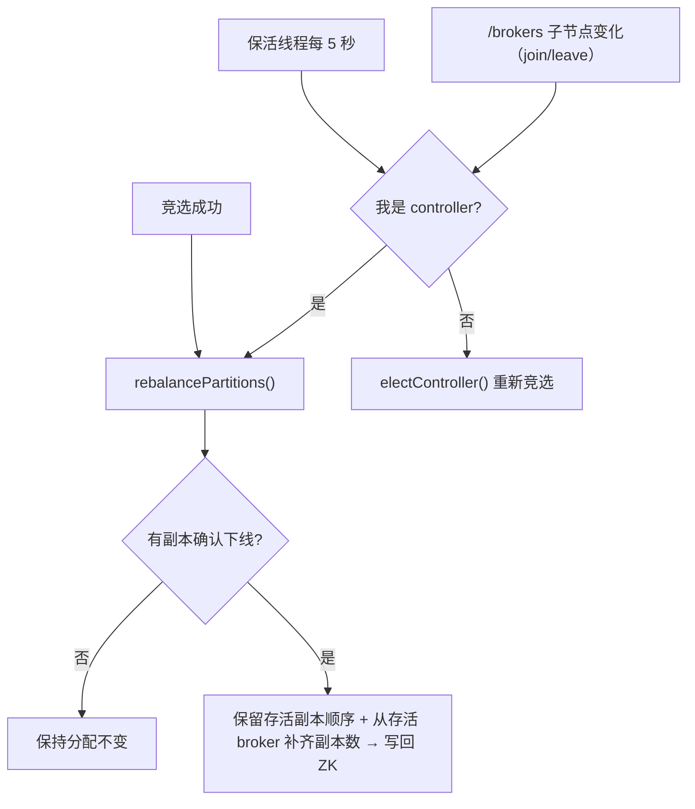
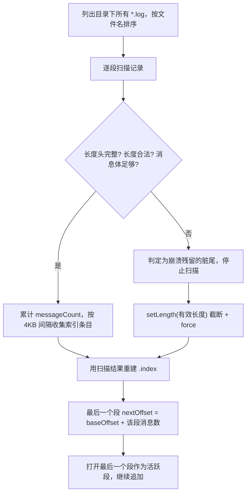

# SimpleKafka — 运行原理与业务流程

> ## ⚠️ 项目声明
>
> - 本项目是一个**由 AI（GitHub Copilot）辅助编写与生成**的学习型项目：代码、注释与文档均为人机协作产物，
>   **仅用于学习 Kafka 核心机制与原理验证**，可能存在缺陷或简化，请勿用于生产环境。
> - 学习与参考的开源项目地址：**[buildthingsuseful/build-your-own-kafka](https://github.com/buildthingsuseful/build-your-own-kafka)**。
>   本仓库的实现思路、ZooKeeper 元数据布局与线协议设计均参考该项目，特此致谢。
> - 本仓库**不包含**上述参考项目的源码（本地目录 `build-your-own-kafka-main/` 已写入 `.gitignore`，不会被上传）。

一套**可以真跑、可以手动操控、可以观察每一步**的类 Kafka 消息系统。本 README 讲的是「它实际怎么运行」：
从 ZooKeeper 启动、broker 注册、controller 选举、topic 创建、消息生产与复制、消息消费，
一直到消息落盘与重启后读回来，以及各种边缘问题的成因与处理办法。

> 所有描述都对应仓库里的真实代码，括号里给出方法名（如 `SimpleKafkaBroker.electController()`），
> 可以边读边对照源码与界面日志。

---

## 目录

1. [30 秒跑起来](#1-30-秒跑起来)
2. [三个角色与总体架构](#2-三个角色与总体架构)
3. [数据模型与磁盘布局](#3-数据模型与磁盘布局)
4. [全流程：从启动到消息可读](#4-全流程从启动到消息可读)
   - 4.1 [启动 ZooKeeper](#41-启动-zookeeper)
   - 4.2 [Broker 启动与注册](#42-broker-启动与注册)
   - 4.3 [Controller 选举](#43-controller-选举)
   - 4.4 [创建 Topic：哪些 Broker 参与](#44-创建-topic哪些-broker-参与)
   - 4.5 [生产消息：一条消息的完整旅程](#45-生产消息一条消息的完整旅程)
   - 4.6 [消息复制](#46-消息复制)
   - 4.7 [消费消息：是不是任意 Broker 都能消费](#47-消费消息是不是任意-broker-都能消费)
   - 4.8 [什么时候重新分配副本（replace / rebalance）](#48-什么时候重新分配副本replace--rebalance)
   - 4.9 [持久化：消息怎么落盘](#49-持久化消息怎么落盘)
   - 4.10 [重启后：持久化的数据怎么读回来](#410-重启后持久化的数据怎么读回来)
5. [边缘问题：现象 → 原因 → 处理](#5-边缘问题现象--原因--处理)
6. [协议速查](#6-协议速查)
7. [常量速查](#7-常量速查)
8. [10 分钟实操验证清单](#8-10-分钟实操验证清单)
9. [已知限制与第二阶段计划](#9-已知限制与第二阶段计划)

---

## 1. 30 秒跑起来

```bash
cd /你的路径/build-your-own-kafka

# 构建（必须带 clean，见第 5 节「构建坑」）
mvn clean package -DskipTests

# 启动可视化控制台（它同时是进程管理器）
java -cp target/simple-kafka-1.0-SNAPSHOT.jar \
     com.simplekafka.dashboard.DashboardServer 8080 2181
```

浏览器打开 <http://localhost:8080/control>，然后在页面上：
**① 填节点数 → 启动三集群 → ② 新增/移除节点 → ③ 创建 Topic → ④ 生产 → ⑤ 拉取（消费）→ ⑥ 看底部日志与磁盘文件面板**。

| 端口 | 用途 |
| --- | --- |
| 8080 | 控制台 HTTP（`/` 与 `/control` 为控制室，`/dashboard` 为旧页） |
| 2181 | ZooKeeper 客户端端口（元数据 `/brokers`、`/topics`、`/controller`） |
| 9091 | broker-1 |
| 9092 | broker-2 |
| 9093 | broker-3（第 N 个 = `9090 + N`，节点数不设上限） |
| — | 数据目录 `data/<brokerId>/<topic>/<partition>/`；ZK dataDir `/tmp/simple-kafka-zk-dashboard` |

命令行也能单独跑（不依赖控制台）：

```bash
# Broker
java -cp target/simple-kafka-1.0-SNAPSHOT.jar com.simplekafka.broker.SimpleKafkaBroker 1 localhost 9091 2181

# Producer（topic 不存在会自动创建 3 分区、副本数 2，然后发 10 条）
java -cp target/simple-kafka-1.0-SNAPSHOT.jar com.simplekafka.client.SimpleKafkaProducer localhost 9091 demo

# Consumer（从 offset 0 持续消费 partition 0）
java -cp target/simple-kafka-1.0-SNAPSHOT.jar com.simplekafka.client.SimpleKafkaConsumer localhost 9091 demo 0
```

---

## 2. 三个角色与总体架构

| 角色 | 职责 | 关键类 |
| --- | --- | --- |
| **ZooKeeper** | 只存**元数据**（谁在线、谁是 controller、每个分区的 leader/follower），**不存消息**。临时节点 + watch 是故障感知的基础 | 外部进程 `QuorumPeerMain`；客户端封装 `ZookeeperClient` |
| **Broker** | 存消息、服务请求、复制数据；其中**一个** broker 同时是 controller，负责分配与再平衡 | `SimpleKafkaBroker` + `Partition` |
| **Client / 控制台** | 生产者发送、消费者拉取；控制台负责起停进程、看元数据、手工生产/消费 | `SimpleKafkaClient`、`SimpleKafkaProducer/Consumer`、`DashboardServer` |



**一句话概括职责边界**：ZooKeeper 决定「谁负责哪个分区」，broker 负责「把消息写下来并复制」，
client 负责「按元数据找到负责的 broker」。

---

## 3. 数据模型与磁盘布局

### 3.1 Topic / Partition / Segment / Offset

- **Topic**：逻辑名字，由 `N` 个 **Partition** 组成（默认 3）。
- **Partition**：最小并行与复制单位。每个分区有**一个 leader**（唯一可写）和 `RF-1` 个 follower。
- **Offset**：分区内单调递增的 `long`，**由 leader 分配**，全局唯一标识「这个分区里的第几条消息」。
- **Segment（段）**：分区在磁盘上按大小切段，段文件名就是该段第一条消息的 offset。

### 3.2 磁盘布局（真实示例）

```
data/1/persist-test/0/
  00000000000000000000.log      消息数据：每条记录 = [4B 长度][消息体]
  00000000000000000000.index    稀疏索引：每 ~4KB 一条，条目 = [4B 相对offset][4B 相对position]
  00000000000000000104.index    超过 1MB 后滚动出的第二段（段名 = 段内首条消息 offset）
  00000000000000000104.log
```

- 段上限 `MAX_SEGMENT_BYTES = 1MB`（真实 Kafka 默认 1GB，这里调小以便观察多段行为）。
- 索引是**加速结构**，不是真相：启动时完全按 `.log` 重建，删掉也能自愈。
- 实测索引占比约 **0.08%**（1.2MB 日志 → 960B 索引）。

### 3.3 ZooKeeper 元数据布局

| 路径 | 内容 | 节点类型 | 谁创建 |
| --- | --- | --- | --- |
| `/brokers/<id>` | `host:port` | **临时** | 每个 broker 自己 |
| `/controller` | controller 的 broker id | **临时** | 竞选成功的那个 broker |
| `/topics/<topic>` | 空 | 持久 | controller |
| `/topics/<topic>/partitions/<p>` | `leader;f1,f2,`（分号分隔 leader，逗号分隔 follower） | 持久 | controller |

> 临时节点是整套故障感知的基石：broker 进程一死，它持有的 `/brokers/<id>` 会在**会话超时（30 秒）**后被 ZK 删除，
> 其它 broker 通过 watch 立刻知道「有人下线了」。

### 3.4 一个容易被忽略的事实：每个 broker 都会为**所有**分区建目录

`loadTopic()` 对 topic 下每个分区都会 `mkdirs` 并构造一个 `Partition`（打开一个空段文件），
**不管自己是不是该分区的副本**。所以你会看到非副本 broker 上存在 `0` 字节的 `.log`：

```
data/3/persist-test/0/00000000000000000000.log   0 字节   ← broker-3 不是 p0 的副本，从未收到数据
```

判断「谁真的持有数据」看**字节数是否非 0**，而不是「目录是否存在」。

---

## 4. 全流程：从启动到消息可读

下面按「你点击的顺序」展开，每一步都给出：**做了什么 → 落到哪里 → 在界面上怎么确认**。

### 4.1 启动 ZooKeeper

控制台 `startZooKeeper(port)` 做的事情：

1. 生成临时配置文件 `/tmp/simple-kafka-zk-*.cfg`：`tickTime=2000`、`dataDir=/tmp/simple-kafka-zk-dashboard`、
   `clientPort=2181`、`maxClientCnxns=60`、`admin.enableServer=false`。
2. 用**当前进程一样的 classpath** 拉起 `org.apache.zookeeper.server.quorum.QuorumPeerMain <cfg>`。
3. 等待端口就绪（`waitForPort`，最多 20 秒）再开始起 broker —— 否则冷启动的注册竞争会让部分 broker 掉线。

> **为什么把 ZK 日志降到 WARN**：ZK 用 logback，jar 里没有 `logback.xml` 时默认 root=DEBUG，
> 会把日志面板刷满。已在 `src/main/resources/logback.xml` 设为 WARN；排查 ZK 细节时改成 DEBUG 重新打包即可。

**界面确认**：进程列表出现 `zookeeper`（绿色），ZooKeeper 中心能展开 `/brokers`、`/topics`。

### 4.2 Broker 启动与注册

`SimpleKafkaBroker.main()` → `start()` 依次做：

| 步骤 | 代码 | 结果 |
| --- | --- | --- |
| 1. 绑定端口 | `serverChannel.bind(host:port)`，随后设为**非阻塞** | `:9091` 可连接 |
| 2. 连 ZK 并注册 | `registerWithZookeeper()` → `createEphemeralNode("/brokers/1", "localhost:9091")` | ZK 里出现临时节点 |
| 3. 记入本地缓存 | `clusterMetadata.put(1, self)` | 后续分发用 |
| 4. 挂 watch | `/brokers` 子节点变化、`/topics` 子节点变化 | 集群变化能被感知 |
| 5. 竞选 controller | `electController()` | 见 4.3 |
| 6. 加载已有 topic | `loadTopics()` → 对每个 topic `loadTopic()` | 本地分区对象 + 段文件就绪 |
| 7. 启动**注册保活线程** | `startRegistrationKeeper()` 每 5 秒 | 自愈，见下 |
| 8. 提交 accept 循环 | `executor.submit(this::acceptConnections)` | 开始服务请求 |

**注册保活线程（每 5 秒）做三件事**：

1. ZK 连接断了就重连（`zkClient.connect()`），并重挂 watcher；
2. `/brokers/<id>` 不存在就补建 —— 专门解决「**被强杀后立刻重启，旧会话的临时节点还没过期（最长 30 秒）**，
   导致新进程注册失败、节点永久隐身」这个坑；
3. 刷新所有 topic 的 leader/follower 缓存；若 `/controller` 消失则重新竞选。

**界面确认**：Broker 面板显示 `broker-1 9091 在线`；ZK 中心 `/brokers` 下有 `1/2/3`。

### 4.3 Controller 选举

Controller 不是配置出来的，而是**抢注 ZooKeeper 临时节点**抢出来的（`electController()`）：



详细规则：

1. 若 `/controller` 存在但**数据为空** → 先删掉再竞选（避免抢到「空壳」）。
2. 尝试 `createEphemeralNode("/controller", "<自己的id>")`：
   - 成功 → `isController = true`，立即执行一次 `rebalancePartitions()`（把分区分配对齐到当前存活节点）。
   - 抛 `NodeExistsException` → 说明别人抢先了，读取当前值、并 `watchNode("/controller")` 等待变化。
3. Watch 到 `NodeDeleted`（controller 进程死掉或会话过期）→ `onControllerChange()` → 重新走一遍竞选。

**关键点：controller 只是一个普通的 broker**，它同时还要正常服务生产/拉取请求；它死后由存活 broker 重新抢注。

**界面确认**：控制台顶部显示 `Controller = 1`，含义是「ZK 的 `/controller` 节点数据为 1，即 broker-1 当前是 controller」。
它不等于「集群有 1 个节点」，也不代表 broker-1 承担全部负载 —— 只承担**元数据分配**职责。

### 4.4 创建 Topic：哪些 Broker 参与

请求可能落到**任意** broker（客户端 `createTopic()` 发给 bootstrap broker），处理逻辑：

```
handleCreateTopicRequest()
  ├─ topic 已存在 → ERROR_RESPONSE("Topic already exists")
  ├─ 参数非法（分区≤0 / 副本≤0 / 副本数 > 当前 broker 数）→ ERROR_RESPONSE
  ├─ 我是 controller        → createTopicLocally()  ← 本地创建
  └─ 我不是 controller      → forwardCreateTopicToController()
```

**副本分配算法**（`createTopic()`，由 controller 执行）：

1. **参与者** = ZooKeeper `/brokers` 的**实时子节点**（不是内存缓存！否则会把已下线节点选成 leader，请求悬空）。
2. 让 `brokers = [b0, b1, ..., b(n-1)]`（按 id 排序的存活节点），分区 `p`（从 0 开始）：
   - **leader** = `brokers[p % n]` —— 轮转，天然把 leader 打散到不同节点；
   - **followers** = 从 leader 往后数 `RF-1` 个（环形取模），得到 `brokers[(p+1) % n]`、`brokers[(p+2) % n]`…
3. 写 ZK：`/topics/<t>/partitions/<p>` = `leader;f1,f2,`；
4. 在**自己**的数据目录建好分区目录与段文件；
5. **通知其它 broker**：`notifyBrokerForTopicCreation()` 用 `TOPIC_NOTIFICATION(0x23)` 让对方 `loadTopic(topic)`，
   这样新 broker 无需重启就能把 topic 挂上。

以 3 个 broker、3 分区、RF=2 为例，结果一定是：

| 分区 | leader | follower |
| --- | --- | --- |
| 0 | broker-1 | broker-2 |
| 1 | broker-2 | broker-3 |
| 2 | broker-3 | broker-1 |

**界面确认**：ZK 中心 `/topics/<t>/partitions/0` 数据为 `1;2,`；
broker 日志出现 `Creating topic t over live brokers [1, 2, 3]` 与
`Created partition 0 for topic t with leader 1 and followers [2]`。

### 4.5 生产消息：一条消息的完整旅程

`Producer.send()` → `SimpleKafkaClient.send(topic, partition, bytes)`：

1. **拿元数据**：若本地没有该 topic，先向 bootstrap broker 发 `METADATA(0x03)`，得到
   `{brokers: [{1,localhost:9091}, ...], topics: [{name, partitions: [{id, leader, followers}]}]}`。
2. **定 leader**：从元数据里找该分区的 leader，直接连**leader 的地址**发 `PRODUCE(0x01)`。
3. **broker 侧**（`handleProduceRequest`）：
   - `requirePartition()` 取出分区（若本地未加载或缓存 leader 已不在集群 → 先 `loadTopic()` 刷新）；
   - 若 `partition.getLeader() != 自己` → `forwardProduceToLeader()`（**客户端元数据过期时的兜底**）；
   - 否则 `partition.append(message)` → **leader 分配 offset**；
   - `replicateToFollowers()` 异步把消息推给所有 follower（见 4.6）；
   - **立即**回 `PRODUCE_RESPONSE + offset` 给客户端（不等 follower ack，没有 ISR 语义）。



**要点**：offset 由 leader 单点分配，因此同一分区不会出现 offset 冲突；
客户端拿到的 offset 一定是最新的 `log end offset - 1`。

### 4.6 消息复制

`replicateToFollowers(topic, partition, message, offset)`：

- 对分区的每个 follower **提交一个异步任务**（`executor.submit`），互不阻塞；
- 报文 `REPLICATE(0x21)` 字段：`type(1) + topicLen(2) + topic(N) + partition(4) + offset(8) + msgLen(4) + msg(M)`
  —— 容量必须是 `19 + topic.length() + message.length`（历史上一处 17 的笔误让复制彻底失效，见第 5 节）；
- follower 侧 `handleReplicateRequest()` → `partition.appendAtOffset(leaderOffset, message)`：
  - `offset < 本地LEO` → **幂等忽略**（重复投递不会写重）；
  - `offset > 本地LEO` → 记录 `Replication gap` 警告后跳到 leader 的 offset（没有日志追赶，见限制）；
  - 写入后回 `REPLICATE_ACK`。

**副本一致性的验证方式**：比较各副本 `*.log` 的**总字节数**是否完全相同。
实测：`{broker1: 1200600, broker2: 1200600}`，逐字节对齐。

### 4.7 消费消息：是不是任意 Broker 都能消费

**客户端路径**：`SimpleKafkaConsumer.poll()` → `SimpleKafkaClient.fetch(topic, partition, offset, maxBytes)`：

1. 同样先取元数据，**按元数据找到该分区的 leader**，把 `FETCH(0x02)` 发给 leader；
2. broker 侧 `handleFetchRequest()`：
   - `requirePartition()`（必要时刷新元数据）；
   - `offset >= 分区 LEO` → 返回「0 条」；
   - 否则 `partition.readMessages(offset, maxBytes)`（**读本地磁盘**，走稀疏索引 + 顺序扫描）；
   - 回 `FETCH_RESPONSE`：`type(1) + count(4) + 每条[offset(8), len(4), payload]`；
3. **offset 由消费者自己保存**（`currentOffset` 字段），每次 `poll()` 成功后 `currentOffset += messages.size()`。

**那到底能不能用任意 broker 消费？** 分三种情况说清楚：

| 场景 | 结果 | 原因 |
| --- | --- | --- |
| 用控制台/客户端（正常用法） | ✅ 一定能拿到目标分区的完整数据 | 客户端会按元数据把请求发给 leader |
| 直连**非 leader 的副本** broker | ⚠️ 能读到，但只读到**它本地已复制到的部分** | `handleFetchRequest` **不会转发**，只读本机 `Partition`；副本同步是异步的，非副本 broker 本地 LEO 一直是 0（返回空） |
| 直连**非副本** broker | ❌ 返回空 | 它从未收到该分区的复制数据（只有 0 字节段文件） |

也就是说：**「任意 broker 都能消费」在本实现里是「任意 broker 都能应答」，但只有 leader 和已同步的副本才有完整数据。**
控制台 `/api/fetch?port=9092` 里的 `port` 只是 **bootstrap 入口**，真正读的是元数据指定的 leader，
所以从界面看「换哪个端口都能拉到」是正常的（请求被路由到了 leader）。

> 真实的 Kafka 用 follower fetch + `isr`/`high watermark` 让消费者可以从任意副本读且保证不读到未提交数据；
> 本 demo 只保证「正常路径下副本字节一致」，没有 HW 就没有「已提交」这个概念。

### 4.8 什么时候重新分配副本（replace / rebalance）

**判定谁是 controller：以 ZooKeeper 的 `/controller` 为唯一真相源**（`amController()`），
本地 `isController` 只是缓存，每次判断都会顺便校准它。
「本地说不是、ZK 说是」正是历史上创建 topic 自环转发的根因，所以这一条必须从 ZK 读。

`rebalancePartitions()` 只在 controller 上生效，规则如下：

1. **存活集合**取 ZooKeeper 实时 `/brokers` 子节点（不是本地缓存 —— 本地视图可能还没追平）；
2. 一个副本只有在同时满足下面两条时才被判定为**确认下线**：
   - 不在实时存活集合里；**且**
   - 已经缺席超过 **15 秒**（`BROKER_ABSENCE_GRACE_MS`）；
   - 特殊情况：本次启动后**从未见过**该 id（典型场景：集群正在冷启动、同伴还没注册完）→
     启动后 15 秒内保持保守不动，之后就以 ZK 为准（否则重启一次后，永远的「僵尸副本」再也不会被清理）。
3. 只要有一个副本被确认下线：**保留原列表中仍存活的节点及其顺序**（所以「第一个 follower 接任 leader」
   这个直观行为成立），再用其它存活 broker 按 id 顺序**补齐到原来的副本数量**，写回 ZK；
4. 没有任何副本确认下线 → **分配原样不动**。



**触发时机**（四类）：

| # | 触发点 | 代码路径 | 周期 |
| --- | --- | --- | --- |
| 1 | 有 broker 上下线（`/brokers` 子节点变化） | `onBrokersChanged()` → controller 则 rebalance，否则重新竞选 | 事件驱动 |
| 2 | 某 broker 刚当上 controller | `electController()` 成功分支 | 事件驱动 |
| 3 | 保活线程的周期检查 | `startRegistrationKeeper()` → `amController() && rebalancePartitions()` | **每 5 秒** |
| 4 | 请求时发现 leader 已不在集群（**只刷新本地缓存，不改 ZK**） | `requirePartition()` → `loadTopic()` | 按需 |

> 第 3 条是「宽限期到期后仍能被清理」的关键：否则移除一个 broker 后，
> 因为不再发生新的成员变更事件，分配永远停在那里没人管。
> 它同时也是**自愈合**：即使漏掉一个 watch 事件，5 秒内也会自己纠正。

**所以「leader 被销毁后如何选出新 leader」的答案是**：

1. leader 进程死 → 它的 ZK 临时节点 `/brokers/<id>` 消失（优雅退出立即；被强杀则等**会话超时最长 30 秒**）；
2. 存活 broker 的 `/brokers` watcher 触发 `onBrokersChanged()`（或最多 5 秒后的周期检查兜住）→
   由 controller 调 `rebalancePartitions()`；
3. controller 把死掉的 leader 从副本列表剔除，**原来的第一个 follower 顺位成为新 leader**
   （因为顺序被保留），同时从其它存活 broker 补一个 follower 进去，写回 ZK；
4. 各 broker（每 5 秒刷新 + 请求时按需刷新）与客户端（下次取元数据时）拿到新 leader。

**实测**：

| 场景 | 现象 |
| --- | --- |
| 优雅「移除」一个 broker | 约 **5 秒**后 ZK 分配不再引用它，并用其它存活 broker 补齐副本数 |
| 手工把永不存在的 `9` 写进 `/topics/<t>/partitions/0`（僵尸副本） | 重启后约 **20 秒**（启动宽限期到期）被清理为 `1;[2]` |
| 集群重启（旧代码） | ❌ 副本被缩成 1 个、复制静默失效 —— 见 5.14 |

### 4.9 持久化：消息怎么落盘

`Partition.append(byte[])`（leader 路径）：

1. 取写锁（读操作可用读锁并行）；
2. `writeRecord(offset, message)`：
   - 判断当前活跃段**放不放得下**这条消息（`size + 4 + len > 1MB`）→ 放不下且当前段非空则**滚动新段**（新段名 = 当前 offset）；
   - 定位写入位置 = 活跃段已跟踪的 `size`，写 `[4B 长度][消息体]`，循环写满；
   - `FileChannel.force(true)` —— **每条消息都 fsync**（本 demo 为了「讲了就一定能看到」而牺牲吞吐）；
   - **稀疏索引**：距上次索引项 ≥ 4KB 才追加一条 `[4B 相对offset][4B 相对position]`；
   - 更新段状态（`size`、`messageCount`、`lastIndexPosition`）；
3. `nextOffset = offset + 1`。

follower 路径 `appendAtOffset(offset, message)` 复用同一套写入逻辑，只是 offset 来自 leader，
从而保证**副本之间 offset 严格对齐**。

### 4.10 重启后：持久化的数据怎么读回来

`Partition.initialize()` 在构造时执行**恢复流程**（每个分区、每个段）：



四条关键保证：

1. **脏尾截断**：长度头被截断、长度非法（≤0 或 >16MB）、消息体不足 → 从该位置截断，
   日志给出 `Dirty tail detected ... / Recovered ... dropped N byte(s)`。
   这样 offset 不会倒退，后续追加也不会写在半条记录之后。
2. **索引重建**：索引每次启动都按 `.log` 重新生成（稀疏格式），所以索引损坏/丢失/格式升级都不影响数据。
3. **读路径跨段**：`readMessages(offset, maxBytes)` 先二分定位段 → 段内用稀疏索引二分找「不大于目标的最近条目」→
   顺序扫描到目标 → 读到段末尾自动切到下一段继续（直到满足 `maxBytes` 或追上 LEO）。
4. **客户端大批量拉取**：客户端按协议长度**精确读取**响应（不再假设 64KB 够用），
   `1MB` 级别的拉取也不会 `BufferUnderflowException`。

**实测（线上崩溃模拟）**：停机后往最后一段尾部写 34 字节垃圾 → 重启 → 文件自动回到 160097 字节原长度，
121 条消息与 offset 完全不变，新消息从 121 继续。

---

## 5. 边缘问题：现象 → 原因 → 处理

### 5.1 点击「启动三集群」却显示未启动
- **原因**：页面同时校验「控制台托管的进程」与「ZooKeeper 里的注册」；ZK 未就绪时注册竞争会让部分 broker 掉线。
- **处理**：控制台现在会先 `waitForPort(2181)` 再起 broker；刷新页面即可；端口被已有进程占用时会自动复用。

### 5.2 新增节点后页面不显示 / 第 4 个节点看不到
- **原因**：早期版本把节点数写死为 3；且进程被杀后临时节点未过期，新进程注册被拒。
- **处理**：节点数不设上限（`count=N`、`/api/cluster/add` 自动分配 id/端口）；
  broker 注册保活线程每 5 秒补建 `/brokers/<id>`；控制台也会用 `ProcessHandle` 扫描命令行**自动接管**已有 broker 进程。

### 5.3 「停止全部」点了没反应
- **原因**：broker 的 shutdown hook 卡在 `zkClient.close()`（ZK 已死时无限等待），SIGTERM 杀不掉。
- **处理**：改为**限时关闭 ZK**（2 秒，守护线程）+ hook 内 `halt(0)`；
  控制台侧统一「先 SIGTERM，4 秒未退自动 `destroyForcibly`」，最后再兜底强杀扫描到的 broker / QuorumPeerMain。

### 5.4 生产/拉取报 `Leader broker not found: N`
- **原因**：broker 曾长期缓存启动时的 leader；controller 重新分配后仍转发给已下线节点。
- **处理**：`loadTopic()` 支持刷新已有分区；`requirePartition()` 发现 leader 不在集群时**按需刷新**；
  保活线程每 5 秒刷新；并 watch `/topics` 变化。

### 5.5 分区分配里出现 `followers=[2,]`（指向已下线节点）
- **原因**：早期 rebalance 只看 leader 是否存活，而且只用本地缓存判断存活。
- **处理**：现在 leader **或任一 follower** 确认下线即重建副本列表（保留存活副本顺序 + 补齐到原副本数）。
  但「确认下线」有两个附加条件（实时 ZK 集合 + 缺席宽限期），详见 [4.8](#48-什么时候重新分配副本replace--rebalance)，
  否则会误伤正在启动/刚重启的副本。

### 5.6 消息「拉到了但界面不显示」
- **原因**：控制台消费面板曾只用 `offset` 作去重键，不同分区的同号 offset 互相误杀。
- **处理**：去重键改为 `topic|partition|offset`；每个分区各自记录 `nextOffset`，切换分区时恢复进度。

### 5.7 创建 Topic 长时间无响应，随后 broker「假死」（连元数据都不回）
这是本项目最隐蔽的一个问题，三层原因叠加：
1. **自环转发**：ZK 的 `/controller` 指向本机、但内存 `isController` 标记还没同步时，
   转发逻辑会把请求**转发给自己**，而自己又不是 controller → 无限套娃；
2. **线程池被占满**：工作线程池固定 10 个，被自环请求全部占用后，broker 不再响应任何请求（含 METADATA）；
3. **永不超时**：`SocketChannel` **不遵守 `SO_TIMEOUT`**，对端不响应就永久阻塞，线程永远不释放。

**处理**：
- 转发前判断「目标就是本机」→ 直接本地创建（`createTopicLocally()`），从根上断掉自环；
- 控制面转发改用普通 `java.net.Socket` + `setSoTimeout(5000)`，配合连接超时 3 秒；
- 线程池改为**可增长**（`ThreadPoolExecutor(8, 200, SynchronousQueue)`），个别卡住的连接不再拖垮整个 broker；
- 失败一律回 `ERROR_RESPONSE`，客户端不会干等。

### 5.8 一次拉取 1MB 报 `BufferUnderflowException`
- **原因**：客户端用**固定 64KB** 缓冲区读 fetch 响应，响应更大就被截断；broker 侧单次 `write` 也可能写不全。
- **处理**：客户端按协议长度精确读取（类型→条数→逐条 12B 头 + payload）；
  broker 循环写完整响应，并对**非阻塞**通道的 `write()==0` 让出 CPU。

### 5.9 更换 leader 后 offset 从 0 重新开始
- **原因**：follower 落后（写入期间它不在线），它本地 LEO 小；没有 ISR / 日志追赶 / 截断机制，
  让它当 leader 就会从它自己的 offset 继续。
- **处理**：正常路径下 `appendAtOffset` 保证 offset 对齐；副本是否对齐用**字节数是否一致**核对。
  这是本 demo 的已知限制（真实 Kafka 用 ISR + leader epoch + 日志截断解决）。

### 5.10 ZooKeeper 日志刷屏、出现 `]` 碎片行
- **原因**：ZK 使用 logback，无配置时默认 root=DEBUG；且部分 ZK 日志消息自带换行，被按行读取后切成碎片。
- **处理**：`src/main/resources/logback.xml` 设 `root=WARN`；控制台日志读取改为**完整行缓冲**，
  并过滤 JUL 日期头行/类名行/单独级别词、异常 `at` 堆栈帧等噪声。

### 5.11 构建后行为诡异（功能莫名失效、日志线程静默死掉）
- **原因**：VS Code Java 插件会把 ECJ 的「Unresolved compilation problem」**错误桩 class** 写进 `target/classes`；
  随后 Maven 增量编译认为它比源码新而跳过重编，错误桩被打进 jar，运行时抛 `java.lang.Error`。
- **处理**：**永远用 `mvn clean package -DskipTests`**。另注意项目按 Java 11 语义编译（内部类里不能声明 static 方法）。

### 5.12 broker 刚启动就打印 `Stopping SimpleKafka broker...` 然后退出
- **原因**：`main()` 打印完就返回；如果工作线程被设成 **daemon**，JVM 发现只剩守护线程会立刻退出。
- **处理**：工作线程保持非守护；并在 `main()` 里显式保活（`while (broker.isRunning()) sleep(200)`）。

### 5.13 为什么非副本 broker 上也有 `0` 字节的段文件
- **原因**：每个 broker 的 `loadTopic()` 会为**所有分区**建目录并打开段文件（见 3.4）。
- **说明**：这**不是**bug，判断是否真持有数据要看字节数是否为 0。

### 5.14 重启集群后副本全变成 1 个，复制静默失效
这是修完 5.5 之后引入的**新问题**，很有代表性：

- **现象**：`/topics/<t>/partitions/0` 从 `1;2,` 变成 `1;`（followers 变空）；
  之后生产消息仍然「成功」，但**只有 leader 有数据**，follower 永远拿不到新消息。
- **原因**：集群分批启动时，**最先被拉起的那个 broker 往往最先抢到 controller**。
  此时它自己的 `clusterMetadata` 里只有它自己，而早期的 rebalance 用
  `clusterMetadata.containsKey(replica)` 判断「副本是否存活」→ 还没上线的 broker 被当成死节点删掉，
  且因为当时没有第二个存活节点可以补齐，副本数被缩成 1。
- **处理**（三层）：
  1. 存活集合改用 **ZooKeeper 实时 `/brokers` 子节点**；
  2. 引入**缺席宽限期**：只有「曾见过 + 缺席 > 15 秒」才算确认下线，
     「从未见过」在启动后 15 秒内一律保守不动；
  3. controller 每 5 秒周期性再平衡，保证宽限期到期后仍能清理，同时兼做 watch 事件丢失的自愈合。
- **实测**：修复后重启集群，分配 `[(0,1,[2]),(1,2,[3]),(2,3,[1])]` 完全不变；
  重启后继续生产仍然复制到 follower（两边 `.log` 字节数一致）。

---

## 6. 协议速查

所有报文都是**大端**、以 1 字节类型开头；`topic` 用 `short` 长度前缀 + UTF-8 字节。

| 类型 | 值 | 发送方 → 接收方 | 字段布局 |
| --- | --- | --- | --- |
| `PRODUCE` | `0x01` | client → broker | `len(2)+topic+partition(4)+msgLen(4)+msg` |
| `FETCH` | `0x02` | client → broker | `len(2)+topic+partition(4)+offset(8)+maxBytes(4)` |
| `METADATA` | `0x03` | client → broker | 只有类型字节 |
| `CREATE_TOPIC` | `0x04` | client → broker(→controller) | `len(2)+topic+partitions(4)+replication(2)` |
| `PRODUCE_RESPONSE` | `0x11` | broker → client | `offset(8)+status(1)` |
| `FETCH_RESPONSE` | `0x12` | broker → client | `count(4)+每条[offset(8)+len(4)+payload]` |
| `METADATA_RESPONSE` | `0x13` | broker → client | `brokerCount(4)` + 每 broker`[id(4)+hostLen(2)+host+port(4)]`；再 `topicCount(4)` + 每 topic`[len(2)+topic+分区数(4)` + 每分区`id(4)+leader(4)+followerCount(4)+followerId(4×N)]` |
| `CREATE_TOPIC_RESPONSE` | `0x14` | broker → client | `status(1)` |
| `ERROR_RESPONSE` | `0x1F` | broker → client | `len(2)+错误文本` |
| `REPLICATE` | `0x21` | leader → follower | `len(2)+topic+partition(4)+offset(8)+msgLen(4)+msg` |
| `REPLICATE_ACK` | `0x22` | follower → leader | 只有类型字节 |
| `TOPIC_NOTIFICATION` | `0x23` | controller → broker | `len(2)+topic`，回 1 字节 ack（0 成功 / 1 失败） |

> 报文容量要**逐字段相加**核对：`REPLICATE` 必须是 `19 + topic.length() + msg.length`。

---

## 7. 常量速查

| 位置 | 常量 | 值 | 含义 |
| --- | --- | --- | --- |
| `Partition` | `MAX_SEGMENT_BYTES` | 1 MB | 单段上限，超过则滚动新段 |
| `Partition` | `INDEX_INTERVAL_BYTES` | 4096 | 每写满 4KB 追加一条稀疏索引 |
| `Partition` | `INDEX_ENTRY_BYTES` | 8 | `[4B 相对offset][4B 相对position]` |
| `Partition` | `MAX_RECORD_BYTES` | 16 MB | 单条记录长度上限（识别脏数据） |
| `SimpleKafkaBroker` | `READ_BUFFER_SIZE` | 64 KB | 单连接读缓冲 |
| `SimpleKafkaBroker` | `CONTROL_*_TIMEOUT_MS` | 3000 / 5000 | 控制面转发连接/读超时 |
| `SimpleKafkaBroker` | 线程池 | 8 ~ 200 | 可增长，避免被卡住连接拖垮 |
| `ZookeeperClient` | `SESSION_TIMEOUT` | 30000 | ZK 会话超时（决定故障感知延迟） |
| `ZookeeperClient` | `CONNECT_WAIT_TIMEOUT_MS` | 3000 | 连不上 ZK 时快速失败 |
| `SimpleKafkaClient` | `CONNECT/READ_TIMEOUT` | 3000 / 5000 | 客户端连接/读超时 |
| `SimpleKafkaConsumer` | `MAX_BYTES` / `POLL_INTERVAL_MS` | 1 MB / 100 ms | 单次拉取上限与空轮询间隔 |
| `SimpleKafkaProducer` | 默认建 topic | 3 分区 / RF=2 | 命令行示例的默认值 |

---

## 8. 10 分钟实操验证清单

| # | 操作 | 期望现象 |
| --- | --- | --- |
| 1 | 启动三集群 | 4 个进程全绿；ZK 中心出现 `/brokers/1,2,3` 与 `/controller` |
| 2 | 创建 Topic（3 分区，RF=2） | 三个分区 leader 分别是 1/2/3，follower 轮转 |
| 3 | 生产者发 1 条到 `partition 0` | 返回 `offset=0`；broker 日志出现 `Replicating t-0 offset=0 to followers=[2]` 与 `Replication to follower 2 succeeded` |
| 4 | 消费者从 `offset 0` 拉取 | 能读到该条消息；再从 `offset 1` 拉取返回空 |
| 5 | 连发 120 条 10KB 消息 | 磁盘面板出现两个 `.log`；索引只有几百字节（约 0.08%） |
| 6 | 消费者分页拉取 | 每次 1MB 以内连续返回，offset 严格递增（跨段不错位） |
| 7 | 停止全部 → 启动 | 段文件字节数不变；消息与 offset 完全一致；新消息从原 offset 继续 |
| 8 | 停止后手工往最后一个 `.log` 追加垃圾字节 → 启动 | 日志出现 `Dirty tail detected` / `Recovered ...`，文件被截断回原长度 |
| 9 | 「移除」leader 所在 broker | 几秒后 ZK 分配变为「原第一 follower 当 leader，并补入其它存活 broker」；broker 日志出现 `Reassigned ...` |
| 10 | 停掉集群再启动（已有 topic） | 分配**完全不变**，继续生产仍会复制到 follower（两边 `.log` 字节数一致） |
| 11 | 用 ZK 中心手工 set `/topics/<t>/partitions/0` 为 `9;1,` | 重启后约 20 秒被自动清理为存活 broker（验证「僵尸副本」会被清理） |

---

## 9. 已知限制与第二阶段计划

**当前明确没有的东西**（不要误以为有）：

- **没有 ISR / 高水位 / leader epoch**：复制是「尽力异步」，写成功不等 follower ack；
  follower 落后时换成它当 leader 会丢/回退数据。
- **没有日志追赶与截断**：broker 重新上线后不会补拉缺失区间，只能在下次写入时发现 gap 并前跳。
- **没有保留策略**：段只增不删，不会按时间/大小清理（清理逻辑需与稀疏索引、段列表一起改）。
- **没有消费者位点持久化**：`offset` 只存在消费者进程/页面内存里，重启后需要自己指定起点。
- **每条消息一次 `force(true)`**：为保证「讲了就一定看得到」，吞吐以可讲解为优先。
- **消息无 key / 无 CRC / 无压缩 / 无批量**：记录就是 `[4B 长度][裸字节]`。

**建议的第二阶段顺序**（已在存储层打好基础）：
①保留策略与日志滚动清理 → ②follower 的 fetch 拉取 + 追赶（替代 push 复制）→
③高水位与 ISR → ④消费者位点持久化到内部 topic → ⑤批量/零拷贝与索引 mmap。

---

**相关文档**：日常操作、界面按钮含义与 HTTP API 一览见 [`使用说明.md`](使用说明.md)。
